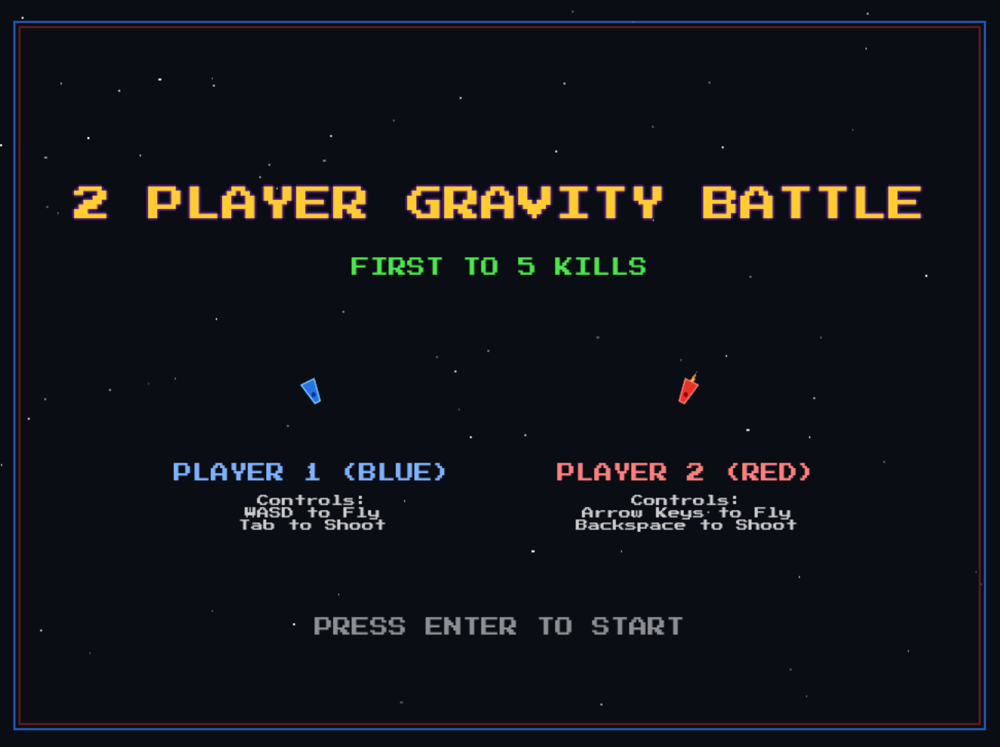

# Gravity Force LÖVE2D Clone

A physics-based cave flyer game inspired by the classic Amiga game *Gravity Force*, built with the **LÖVE** (Love2D) engine.



## 🚀 Getting Started

### Prerequisites

Ensure you have [LÖVE 11.5+](https://love2d.org/) and [just](https://github.com/casey/just) installed.

### Commands

We use `just` as a command runner:

*   **Run the game (windowed):**
    ```bash
    just
    # or
    just run
    ```
*   **Run the game (fullscreen):**
    ```bash
    just fullscreen
    ```
*   **Run unit tests:**
    ```bash
    just test
    ```

---

## 🎮 Controls

*   **Player 1 (Blue):**
    *   **A** / **D**: Rotate ship left / right
    *   **W**: Fire thrusters
    *   **Tab**: Shoot bullets
*   **Player 2 (Red):**
    *   **Left** / **Right**: Rotate ship left / right
    *   **Up**: Fire thrusters
    *   **Backspace**: Shoot bullets
*   **General:**
    *   **Enter**: Start game (on startup screen) or reset to startup screen (on game over screen)
    *   **R**: Reset game state (while playing)
    *   **Esc**: Quit the game

---

## 🧪 Testing

We have built-in collision, movement, and physics unit tests. You can run these via `just test`.

